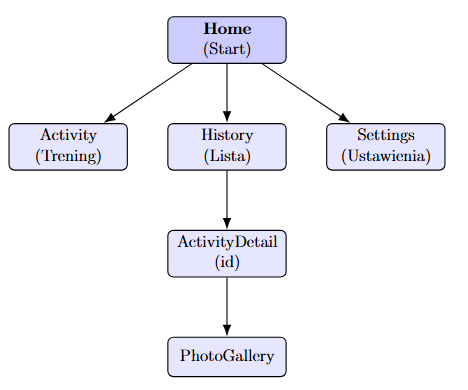
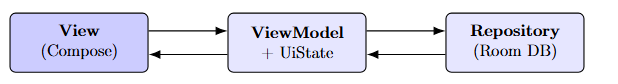
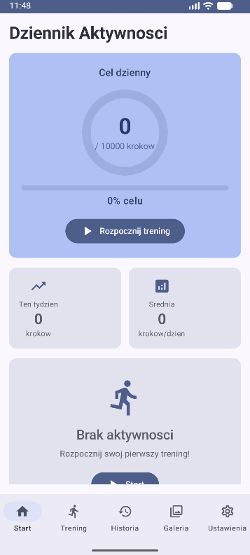
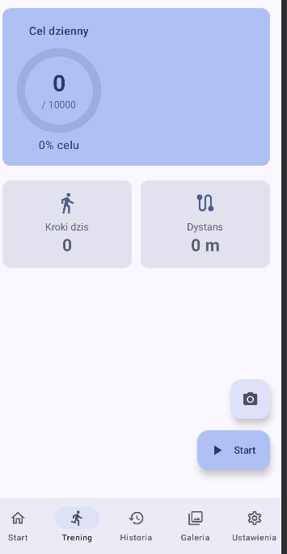
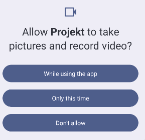
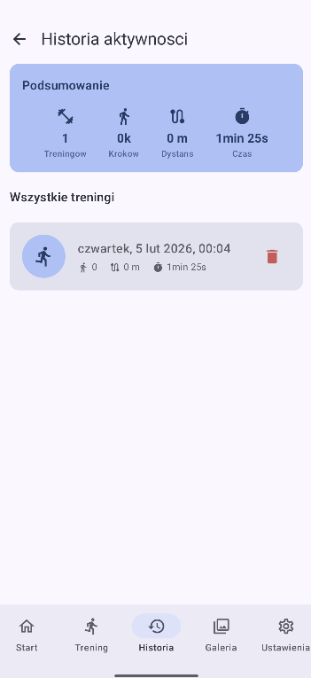
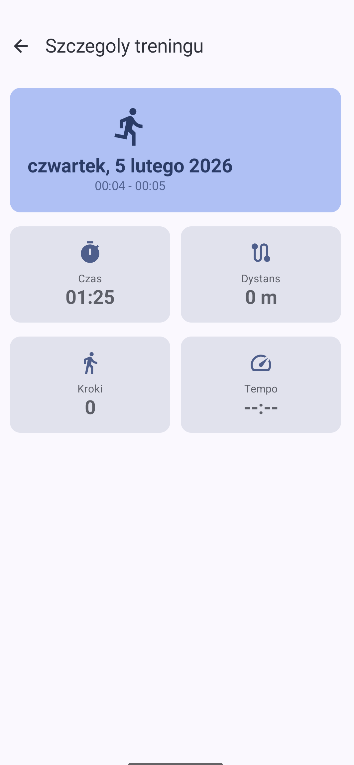
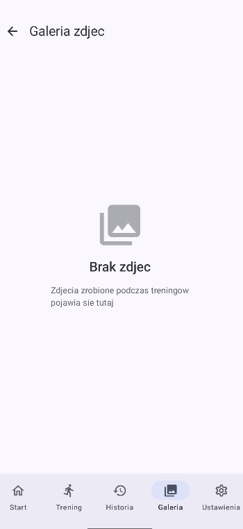
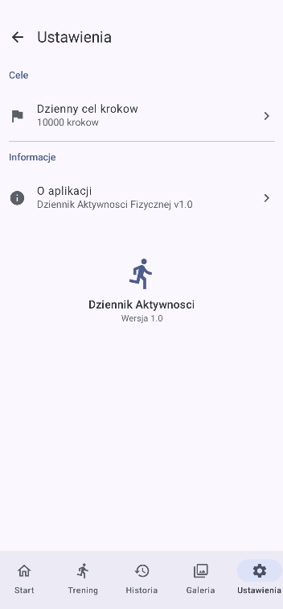

# PROJEKT - Programowanie aplikacji mobilnych
**Aplikacja aktywności fizycznej**

**Uczelnia:** Politechnika Bydgoska  
**Wydział:** Telekomunikacji, Informatyki i Elektrotechniki  
**Autor:** Kacper Skiba (nr albumu: 122420)  
**Data:** 4 lutego 2026

---

## Spis treści
1. [Opis Projektu](#1-opis-projektu)
2. [Wymagania Techniczne](#2-wymagania-techniczne)
    * 2.1 [Jetpack Compose](#21-jetpack-compose)
    * 2.2 [Navigation Compose](#22-navigation-compose)
    * 2.3 [Kotlin](#23-kotlin)
    * 2.4 [Architektura MVVM](#24-architektura-mvvm)
    * 2.5 [Runtime Permissions](#25-runtime-permissions)
3. [Dodatkowe Technologie](#3-dodatkowe-technologie)
4. [Konfiguracja Build](#4-konfiguracja-build)
5. [Screenshoty Aplikacji](#5-screenshoty-aplikacji)

---

## 1. Opis Projektu
Aplikacja mobilna do śledzenia aktywności fizycznej użytkownika. Umożliwia rejestrowanie treningów, liczenie kroków, śledzenie tras GPS oraz dokumentowanie aktywności zdjęciami.

---

## 2. Wymagania Techniczne

### 2.1 Jetpack Compose
Cały interfejs użytkownika został zbudowany przy użyciu Jetpack Compose – nowoczesnego toolkit'u do tworzenia natywnych UI w Androidzie.

**Zastosowanie w projekcie:**
* Deklaratywne budowanie ekranów (HomeScreen, ActivityScreen, HistoryScreen, etc.)
* Komponenty Material Design 3
* Dynamiczne aktualizacje UI w czasie rzeczywistym (np. statystyki podczas treningu)
* Wykresy aktywności przy użyciu biblioteki Vico

> *Rysunek 1: Ekran główny aplikacji – implementacja w Jetpack Compose*

### 2.2 Navigation Compose
Nawigacja między ekranami wykorzystuje Navigation Compose z type-safe routes.

**Zastosowanie w projekcie:**
* Bezpieczne typowo trasy zdefiniowane jako sealed class/data class
* Przekazywanie argumentów między ekranami
* Obsługa stosu nawigacji
* Kotlinx.serialization do serializacji argumentów

**Zdefiniowane trasy:**

| Route | Opis |
| :--- | :--- |
| **Home** | Ekran główny z podsumowaniem dnia |
| **Activity** | Ekran aktywnego treningu |
| **History** | Lista historii treningów |
| **ActivityDetail (id)** | Szczegóły wybranego treningu |
| **PhotoGallery** | Galeria zdjęć z treningów |
| **Settings** | Ustawienia aplikacji |

| Schemat Nawigacji |
| :---: |
|  |
| *Rysunek 2: Navigation Graph* |

### 2.3 Kotlin
Aplikacja napisana w całości w języku Kotlin.

**Zastosowanie w projekcie:**
* Kotlin Coroutines do operacji asynchronicznych
* Flow do reaktywnego strumienia danych
* Extension functions dla czytelności kodu
* Data classes dla modeli danych
* Null-safety dla bezpieczeństwa typów

### 2.4 Architektura MVVM
Aplikacja wykorzystuje wzorzec MVVM (Model-View-ViewModel) z UiState.

| View (Compose) | ViewModel (+ UiState) | Repository (Room DB) |
| :--- | :--- | :--- |

**Komponenty:**
* **ViewModel:** zarządza stanem UI i logiką biznesową
* **UiState:** reprezentuje stan ekranu (loading, success, error)
* **Repository:** abstrakcja dostępu do danych
* **Room Database:** lokalna baza danych

| Warstwa | Przykłady |
| :--- | :--- |
| **View** | HomeScreen, ActivityScreen |
| **ViewModel** | HomeViewModel, ActivityViewModel |
| **Model** | ActivityEntity, DailyStepsEntity |
| **Repository** | FitnessDatabase, DAOs |

| Architektura MVVM |
| :---: |
|  |
| *Rysunek 3: Architektura MVVM* |

### 2.5 Runtime Permissions
Aplikacja poprawnie obsługuje uprawnienia runtime zgodnie z wytycznymi Androida.

**Wymagane uprawnienia:**

| Uprawnienie | Cel | Typ |
| :--- | :--- | :--- |
| `ACTIVITY_RECOGNITION` | Licznik kroków | Runtime (Android 10+) |
| `ACCESS_FINE_LOCATION` | Śledzenie trasy GPS | Runtime |
| `ACCESS_COARSE_LOCATION` | Lokalizacja przybliżona | Runtime |
| `CAMERA` | Robienie zdjęć podczas treningu | Runtime |
| `POST_NOTIFICATIONS` | Powiadomienia o treningu | Runtime (Android 13+) |

**Obsługa uprawnień:**
* Wyświetlanie uzasadnienia przed prośbą o uprawnienie
* Graceful degradation – aplikacja działa bez niektórych uprawnień
* Przekierowanie do ustawień systemu przy odmowie

> *Rysunek 4: Dialog z prośbą o uprawnienia*

---

## 3. Dodatkowe Technologie

| Technologia | Wersja | Zastosowanie |
| :--- | :--- | :--- |
| **Room** | 2.6.1 | Lokalna baza danych |
| **DataStore** | 1.0.0 | Przechowywanie preferencji |
| **Vico** | 1.13.1 | Wykresy aktywności |
| **Coil** | 2.5.0 | Ładowanie zdjęć |
| **Play Services Location** | 21.1.0 | GPS tracking |

---

## 4. Konfiguracja Build

Poniżej przedstawiono kluczowe fragmenty pliku `build.gradle.kts`, definiujące parametry kompilacji (SDK 34, Java 11) oraz włączone funkcjonalności (Jetpack Compose).

```kotlin
plugins {
    alias(libs.plugins.android.application)
    alias(libs.plugins.kotlin.android)
    alias(libs.plugins.kotlin.compose)
    alias(libs.plugins.kotlin.serialization)
    alias(libs.plugins.ksp)
}

android {
    namespace = "com.example.projekt"
    compileSdk = 34

    defaultConfig {
        applicationId = "com.example.projekt"
        minSdk = 24
        targetSdk = 34
        versionCode = 1
        versionName = "1.0"
        testInstrumentationRunner = "androidx.test.runner.AndroidJUnitRunner"
    }

    compileOptions {
        sourceCompatibility = JavaVersion.VERSION_11
        targetCompatibility = JavaVersion.VERSION_11
    }

    kotlinOptions {
        jvmTarget = "11"
    }

    buildFeatures {
        compose = true
    }
}

dependencies {
    // Navigation & Serialization
    implementation(libs.androidx.navigation.compose)
    implementation(libs.kotlinx.serialization.json)

    // GPS & Maps
    implementation("com.google.android.gms:play-services-location:21.1.0")

    // Room (database)
    implementation(libs.room.runtime)
    implementation(libs.room.ktx)
    ksp(libs.room.compiler)

    // Coil (image loading)
    implementation(libs.coil.compose)

    // DataStore (preferences)
    implementation(libs.datastore.preferences)

    // Compose BOM & Material3
    implementation(platform(libs.androidx.compose.bom))
    implementation(libs.androidx.material3)
    
    // ... (pozostałe zależności testowe i UI)
}

### 5 Ekrany Aplikacji
Kluczowe widoki aplikacji (tryb jasny/ciemny):

| Ekran Główny | Trening | Uprawnienia |
| :---: | :---: | :---: |
|  |  |  |
| *Start* | *Aktywny Trening* | *Dialog Uprawnień* |

| Historia | Szczegóły Treningu | Galeria |
| :---: | :---: | :---: |
|  |  |  |
| *Lista Historii* | *Szczegóły wpisu* | *Zdjęcia z trasy* |

| Ustawienia |
| :---: |
|  |
| *Konfiguracja* |
